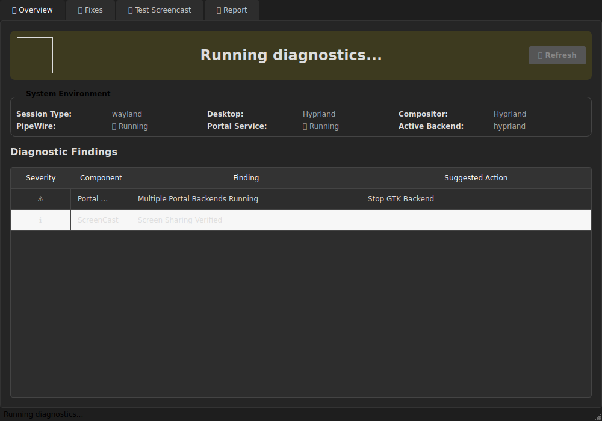
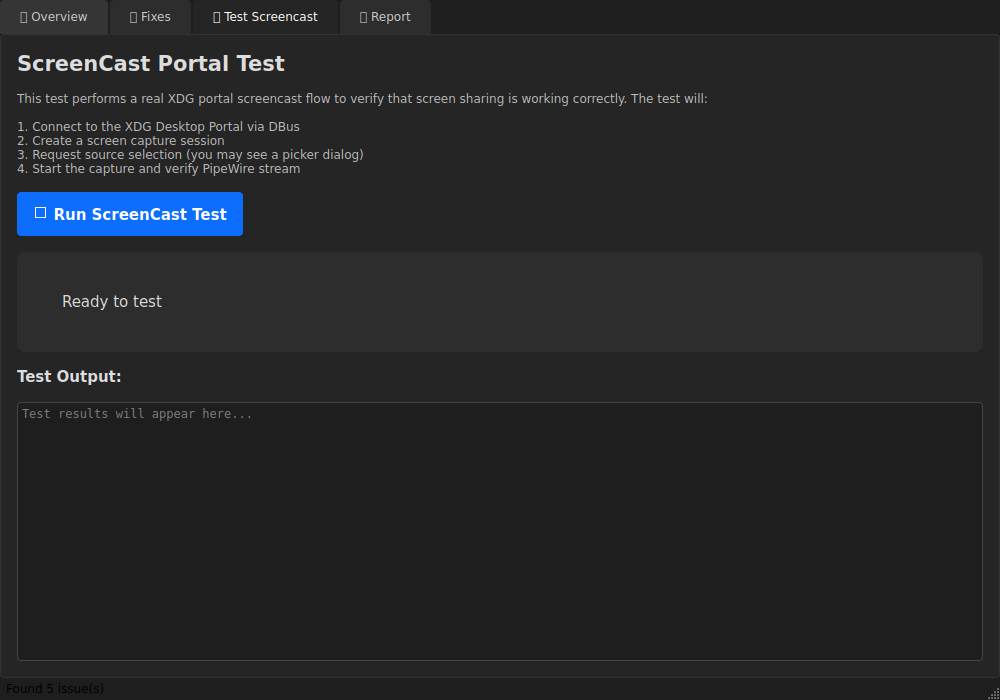
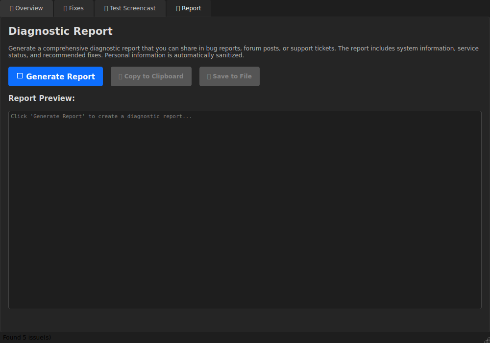

# Portal Doctor

A Linux desktop application that diagnoses and fixes Wayland screen-sharing issues caused by misconfigured/mismatched PipeWire + xdg-desktop-portal + portal backends.

## Purpose

Portal Doctor solves a common pain point for Linux desktop users: screen-sharing issues in Discord, browsers, Electron apps, OBS, Teams, Slack, and anything using the XDG Desktop Portal ScreenCast interface.

The app provides a single GUI that:
- **Detects** your desktop/session/portal stack
- **Diagnoses** common failure modes with specific actionable explanations
- **Applies safe fixes** with preview + backup + undo
- **Runs a portal-based screencast test**
- **Produces a paste-ready diagnostic report** for bug trackers

## Supported Environments

- **KDE Plasma** (Wayland)
- **GNOME** (Wayland)
- **wlroots compositors** (Sway, Hyprland, etc.)
- **X11 sessions** (limited functionality with appropriate warnings)

## Requirements

- Python 3.11+
- PySide6
- dbus-next
- A running Wayland or X11 session
- systemd user session

## Installation

### Using Poetry (Recommended)

```bash
# Clone the repository
git clone https://github.com/RecursiveIntell/portaldoctor
cd portaldoctor

# Install dependencies
poetry install

# Run the application
poetry run portal-doctor
```

### Using pip (from source)

```bash
# Clone and install from source
git clone https://github.com/RecursiveIntell/portaldoctor
cd portaldoctor
pip install .

# Run
portal-doctor
```

### Quick Run (no install)

```bash
# Clone and run directly
git clone https://github.com/RecursiveIntell/portaldoctor
cd portaldoctor
pip install --user PySide6 dbus-next
./run.sh
```

## Usage

### GUI Mode

Launch the graphical interface:

```bash
portal-doctor
# or
python -m portal_doctor
```

The GUI has 4 tabs:
1. **Overview** - Health check with status indicator and findings
2. **Fixes** - One-click fixes with preview and undo
3. **Test Screencast** - Run a real XDG portal screencast test
4. **Report** - Generate diagnostic report for bug trackers

### CLI Mode

```bash
# Run health check
portal-doctor --check

# Generate diagnostic report
portal-doctor --report

# Run screencast test
portal-doctor --test-screencast
```

## Safety

Portal Doctor prioritizes safety:
- **No root required** - Runs entirely as a normal user
- **No silent changes** - Always shows a preview/diff before changes
- **Automatic backups** - All config changes are backed up with timestamps
- **Undo support** - Easily revert any changes made by the app
- **No telemetry** - No network calls, all data stays local

## License

MIT License - See [LICENSE](LICENSE) for details.

## Screenshots


*Overview Tab showing health check status and findings*


*Fixes Tab providing actionable solutions with previews*


*Test Screencast Tab for verifying screen sharing functionality*


*Report Tab generating shareable diagnostic information*

## Contributing

Contributions are welcome! Please read our contributing guidelines before submitting PRs.
