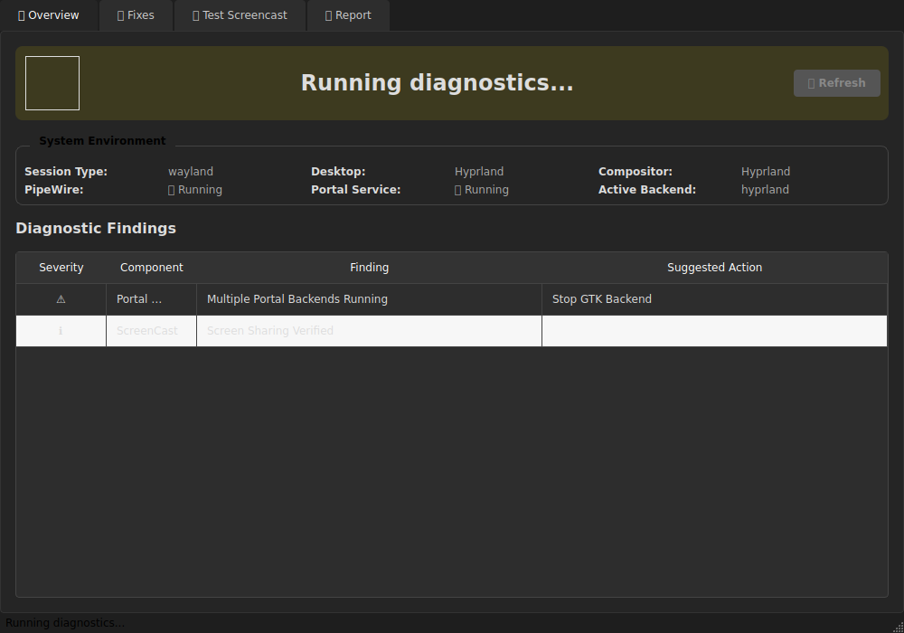
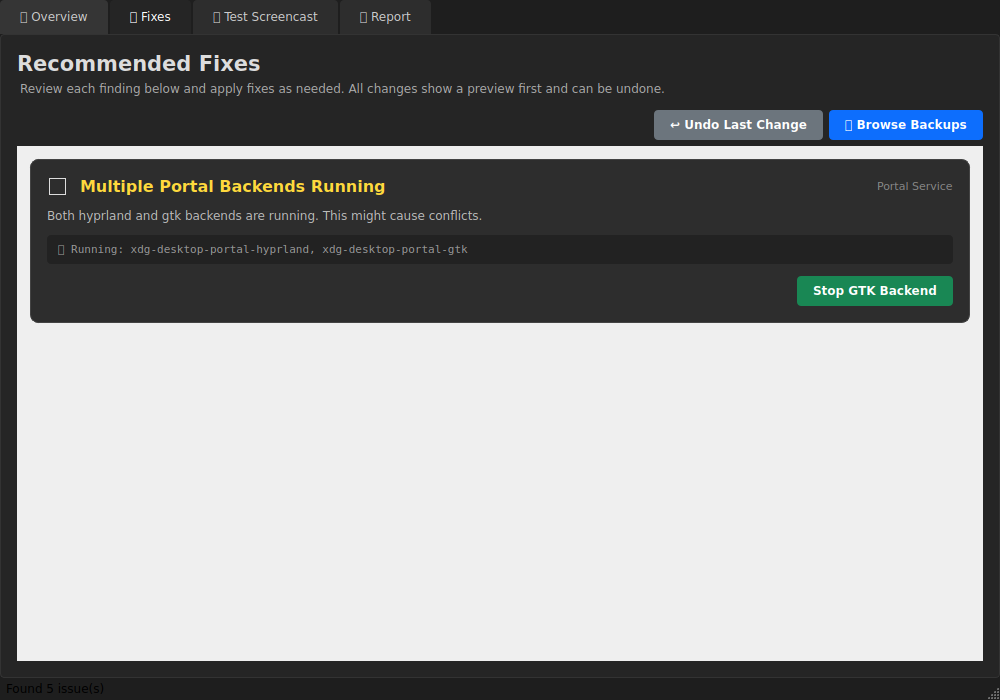
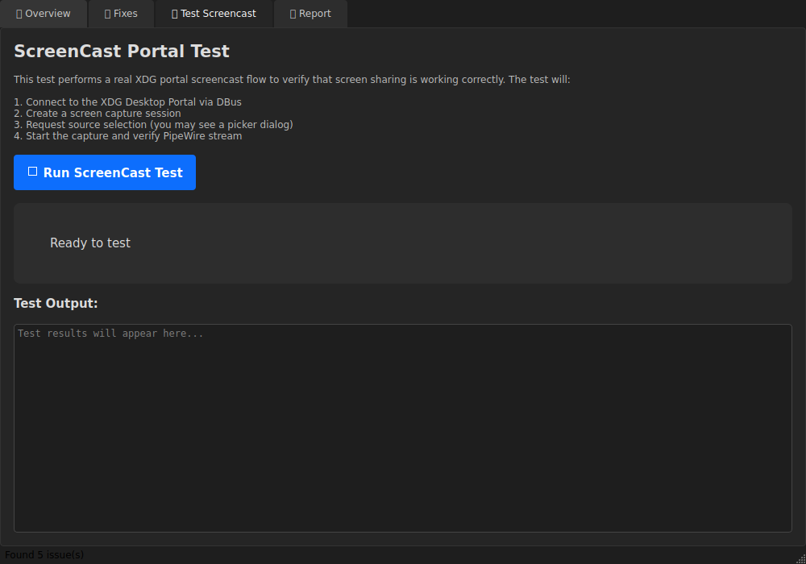
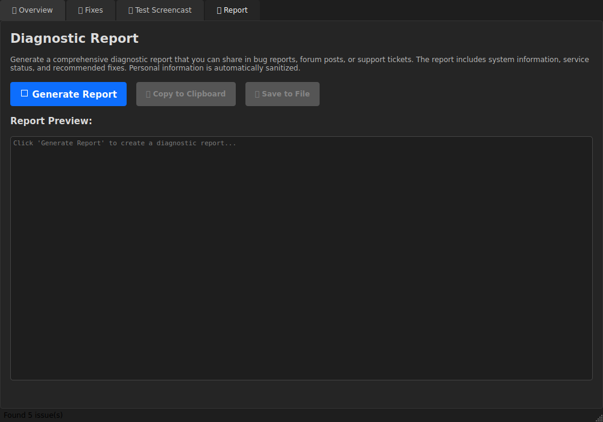

# Portal Doctor

A Linux desktop application that diagnoses and fixes Wayland screen-sharing issues caused by misconfigured/mismatched PipeWire + xdg-desktop-portal + portal backends.

## Purpose

Portal Doctor solves a common pain point for Linux desktop users: screen-sharing issues in Discord, browsers, Electron apps, OBS, Teams, Slack, and anything using the XDG Desktop Portal ScreenCast interface.

The app provides a single GUI that:
- **Detects** your desktop/session/portal stack configuration
- **Diagnoses** common failure modes with specific actionable explanations
- **Applies safe fixes** with preview + backup + undo capabilities
- **Runs a portal-based screencast test** to verify real functionality
- **Produces a paste-ready diagnostic report** for bug trackers and support forums

## Supported Environments

- **KDE Plasma** (Wayland)
- **GNOME** (Wayland)
- **Hyprland**
- **Sway** and other wlroots-based compositors (River, Wayfire, DWL)
- **COSMIC** Desktop (System76)
- **LXQt** (Wayland)
- **Cinnamon**
- **X11 sessions** (limited functionality with appropriate warnings)

## Features

### Diagnostic Rules
- Session type detection (Wayland/X11/TTY)
- DBus session bus availability
- XDG_RUNTIME_DIR validation
- Portal service health monitoring
- Portal backend configuration verification
- PipeWire and WirePlumber status
- Socket activation detection
- GTK_USE_PORTAL environment check
- Flatpak portal access detection
- Multiple conflicting backends detection

### GUI Features
- **Overview Tab**: Real-time health check with color-coded status
- **Fixes Tab**: One-click fixes with diff preview and undo
- **Test Screencast Tab**: Live XDG portal screencast testing
- **Report Tab**: Generate comprehensive diagnostic reports
- **Menu Bar**: File, View, Tools, and Help menus
- **Keyboard Shortcuts**: Ctrl+R (refresh), Ctrl+1-4 (tabs), F5 (test), and more
- **Dark Theme**: Modern, polished dark interface

### CLI Features
```bash
portal-doctor --check              # Run health check
portal-doctor --check --verbose    # Detailed output with evidence
portal-doctor --check --json       # JSON output for scripting
portal-doctor --report             # Generate diagnostic report
portal-doctor --test-screencast    # Run screencast test
portal-doctor --version            # Show version
```

## Requirements

- Python 3.11+
- PySide6 (Qt6)
- dbus-next
- A running Wayland or X11 session
- systemd user session (recommended)

## Installation

### Using Poetry (Recommended)

```bash
# Clone the repository
git clone https://github.com/RecursiveIntell/PortalDoctor
cd PortalDoctor

# Install dependencies
poetry install

# Run the application
poetry run portal-doctor
```

### Using pip

```bash
# Clone and install from source
git clone https://github.com/RecursiveIntell/PortalDoctor
cd PortalDoctor
pip install .

# Run
portal-doctor
```

### Quick Run (No Install)

```bash
# Clone and run directly
git clone https://github.com/RecursiveIntell/PortalDoctor
cd PortalDoctor
./run.sh
```

The `run.sh` script will automatically install dependencies if needed.

## Usage

### GUI Mode

Launch the graphical interface:

```bash
portal-doctor
# or
python -m portal_doctor
```

### Keyboard Shortcuts

| Shortcut | Action |
|----------|--------|
| Ctrl+R | Refresh diagnostics |
| Ctrl+S | Save report to file |
| Ctrl+Q | Quit application |
| F5 | Run screencast test |
| Ctrl+1 | Go to Overview tab |
| Ctrl+2 | Go to Fixes tab |
| Ctrl+3 | Go to Test Screencast tab |
| Ctrl+4 | Go to Report tab |
| Ctrl+/ | Show keyboard shortcuts |

### CLI Mode

```bash
# Basic health check
portal-doctor --check

# Verbose output with evidence and commands
portal-doctor --check --verbose

# JSON output for scripts/automation
portal-doctor --check --json

# Generate and save diagnostic report
portal-doctor --report

# Test screen sharing
portal-doctor --test-screencast
```

## Safety

Portal Doctor prioritizes safety:
- **No root required** - Runs entirely as a normal user
- **No silent changes** - Always shows a preview/diff before changes
- **Automatic backups** - All config changes are backed up with timestamps
- **Undo support** - Easily revert any changes made by the app
- **Log sanitization** - Personal paths and usernames are removed from reports
- **No telemetry** - No network calls, all data stays local

## Development

### Running Tests

```bash
# Using Poetry
poetry run pytest

# Using pytest directly
pytest tests/
```

### Code Style

The project uses `ruff` for linting:

```bash
poetry run ruff check .
poetry run ruff format .
```

## Troubleshooting

### Common Issues

1. **"DBus session bus not available"**
   - Ensure you're running in a graphical session, not SSH or TTY
   - Check: `echo $DBUS_SESSION_BUS_ADDRESS`

2. **"XDG_RUNTIME_DIR not set"**
   - Use a proper display manager (SDDM, GDM, LightDM)
   - Don't use `startx` directly

3. **"No portal backend running"**
   - Install the appropriate backend for your desktop:
     - KDE: `xdg-desktop-portal-kde`
     - GNOME: `xdg-desktop-portal-gnome`
     - Hyprland: `xdg-desktop-portal-hyprland`
     - Sway: `xdg-desktop-portal-wlr`

4. **"Multiple backends running"**
   - Create `~/.config/xdg-desktop-portal/portals.conf` to specify the preferred backend
   - Use the Fixes tab to generate the correct configuration

## License

MIT License - See [LICENSE](LICENSE) for details.

## Screenshots


*Overview Tab showing health check status and findings*


*Fixes Tab providing actionable solutions with previews*


*Test Screencast Tab for verifying screen sharing functionality*


*Report Tab generating shareable diagnostic information*

## Contributing

Contributions are welcome! Please:
1. Fork the repository
2. Create a feature branch
3. Make your changes
4. Run tests (`pytest`)
5. Submit a pull request

## Changelog

See [CHANGELOG.md](CHANGELOG.md) for version history.
